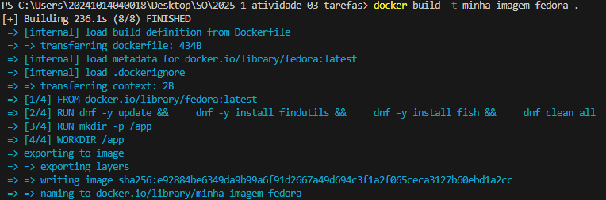
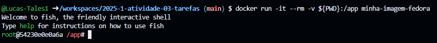
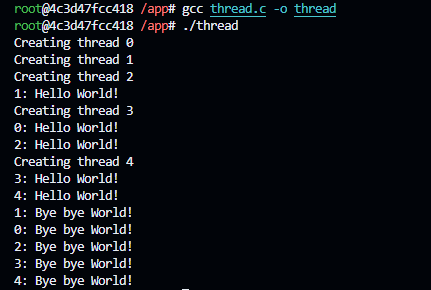

# Compilação de código dentro de docker fedora

**aluno:** [Lucas Tales B. Barbosa](https://github.com/Lucas-Tales1)

**data:** 02/06/2025

## Introdução

Esta atividade tem como objetivo a prática de compilação de código dentro de Docker Fedora 

## Relato

    Construindo uma imagem Docker com Fedora
 
 

    Executando o container com mapeamento de volume
 
 

    Compilação e execução do código fork.c
 
 

    Compilação e execução do código thread.c

## Conclusão

Com essa atividade reforcei meus conhecimentos com Docker e o terminal do Fedora, compilação de código em C bem como sua execução